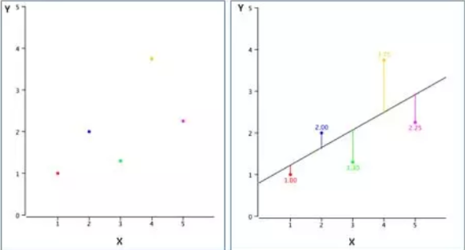

## Linear Regression (Hồi quy tuyến tính)
Linear Regression hay hồi quy tuyến tính là một kỹ thuật học có giám sát, phân tích quan hệ giữa biến phụ thuộc Y với 1 hay nhiều biến độc lập x, dựa trên các dữ liệu có gán nhãn cho trước. 

### Ý tưởng cơ bản 
Hiểu một cách đơn giản bằng hình học: hồi quy tuyến tính tương đương 
với việc ta tìm một đường thẳng sao cho khoảng cách từ nó đ
ến các điểm dữ liệu là nhỏ nhất (tức là nó sát với các điểm dữ liệu nhất), như vậy ta có thể dùng đường đó để dự đoán các điểm xuất hiện trong tương lai.

Ví dụ trong trường hợp hồi quy tuyến tính đơn biến (chỉ có 1 biến):

